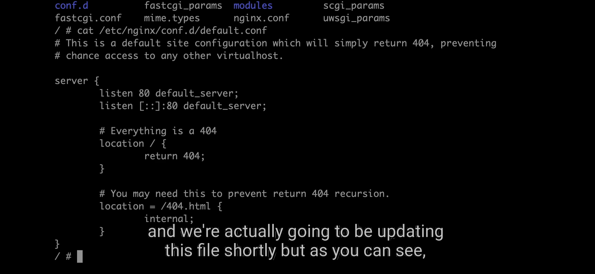
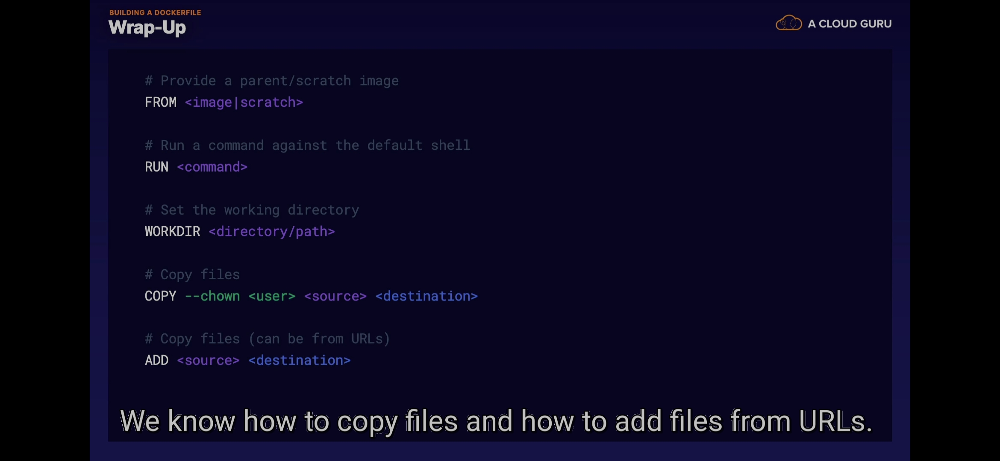

## What is docker ?

Basically docker is a super light-weight
Virtual machine which has all necessery
programs and dependencies in order to run
your program. When we setup big application
which has UI, database, and lots of
microservices we need to do a setup and
each of this services need some kind of program
to work like JAVA and so on. And to setup
everything and installing correctly in the
new server probably would take days.
But most of the time versions are not matching
and other problems so you need to debug it
which is very time consuming. So what dockers
is doing, we create image and we are explaining
what exactly is needed for our program. 
So basically we are saying these are the dependencies,
this is our program where it's coming from and
than we we need to create a container with
our program we just pulling from Docker registry.
And container with a program will be running and
it can be bootsrap in few seconds. So we just
download and start in few seconds and
whoever will be requesting that image will
have exactly same setup. Biggest advantage of
dockers is to ability to have exactly same
setup everywhere and also you can very quickly
bootstrap the whole infrastructure.
And containers can build very quickly.

----------------------------------------------
----------------------------------------------
----------------------------------------------

## What Are Containers ?

* For the past few years, containers have been ubiquitous within the tech world. While the hype has certainly died down some, 
containers won't be going anywhere any time soon.

* Containers, also known as jails, zones, virtual private servers, and a myriad of other names, are isolated execution 
environments that let us quickly and efficiently deploy exact copies of our desired environments. This is done by 
virtualizing at the operating system-level and isolating any libraries and applications within the container.

* Compared to deploying on bare metal which doesn't use virtualization at all, or through virtual machines which 
virtualize at the hardware level, containers are quicker and simpler to deploy while using fewer resources. 
They also maintain an isolated user space that lets us work with different operating systems, packages, 
libraries, and services.

----------------------------------------------
----------------------------------------------
----------------------------------------------

## Container Use Cases

* While speed and portability are certainly impressive, the real benefits of containers shine once we consider 
how they can be used.

* Containers On Their Own Without adding any special functionality, container platforms (like Docker) can help 
us solve an age-old technological problem: the one where it "works on my machine" but not anywhere else. If 
an application is containerized, then an image of the very containers used in production can be supplied to 
developers and administrators to launch on their own workstations. This way it works on all machines.

* Similarly, when migrating applications or services, it may be beneficial to containerize the existing 
infrastructure first. That way, should we need to redeploy or migrate again in the future, we can simply 
redeploy the container instead of having to set up the entire environment. Even in instances where 
configuration management is used, deploy times might be sped up by switching to a container-based architecture.

* Containers can also affect how we architect our applications. Instead of monolithic applications that store 
all services as part of one framework, we can instead use microservices to isolate each individual parts of 
an application. When paired with orchestration, this can be especially powerful.

* Containers with Orchestration and Monitoring That said, rarely do we use containers in a vacuum. Most often, 
containers are used alongside an orchestration platform. Docker, specifically, tends to be paired with Kubernetes 
or Docker Swarm. Once paired with orchestration (and generally some kind of monitoring to report changes) a 
container platform can enhance our reliability and response times to issues and outages.

* This means we can watch for the CPU load on our containers, and when a certain limit is reached, automatically 
deploy or remove containers as needed to match the changes in load. This allows for an elastic architecture.

* Similarly, we can monitor for problems and then automatically terminate and replace any failing containers, 
creating a self-healing architecture. Even in instances where the container's build itself is failing, 
containers have their benefits. For example, it can often be quicker to remove and replace a number of 
containers than it is to redeploy to virtual machines.

* Containers for Deployments Containers also fit nicely into the concept of continuous delivery and continuous 
integration as a whole, the DevOps idea of deploying often and automatically based on changes made to some 
master repository. This means when we make changes to an application and push those changes to its production 
branch, a continuous integration platform will generate a new container image build, test the build, and 
deploy that build (assuming it passed all tests) by removing all old containers and replacing them with 
the new version.

----------------------------------------------
----------------------------------------------
----------------------------------------------

## installing docker for linux

```bash

sudo apt update 

# And then install any prerequisite packages.
# Note that many of these packages are already installed on our Playground server.
sudo apt-get install apt-transport-https ca-certificates curl gnupg-agent software-properties-common 
 
# We can now add Docker's GPG key.
curl -fsSL https://download.docker.com/linux/ubuntu/gpg | sudo apt-key add - 

# And verify its configuration.
sudo apt-key fingerprint 0EBFCD88 

# To add the Docker repository, we now just need to run:
sudo add-apt-repository "deb [arch=amd64] https://download.docker.com/linux/ubuntu $(lsb_release -cs) stable" 

# And update our server again.
sudo apt update 

# We can now install the necessary packages.
sudo apt install docker-ce docker-ce-cli containerd.io 

# To finish up, we want to add our cloud_user user to the docker group.
sudo usermod cloud_user -aG docker 

# Log out then log back in to refresh the Bash session before running any docker commands.
exit

```


----------------------------------------------
----------------------------------------------
----------------------------------------------

## Launching Our First Docker Container

* Now that we have Docker installed, Docker provides a hello-world container to test our installation. This container 
provides us with a high-level overview of what happens when we run a Docker container. Let's check it out by running:

```bash

docker run hello-world

```

* Now let's take a look at the output, starting at the steps provided after the Hello from Docker! message.

1. The Docker client contacted the Docker daemon.
2. The Docker daemon pulled the "hello-world" image from the Docker Hub.
3. The Docker daemon created a new container from that image which runs the executable that produces the output you 
   are currently reading.
4. The Docker daemon streamed that output to the Docker client, which sent it to your terminal.

* To start (1), the Docker client takes our command and relays it to the Docker daemon, which then (2) looks for the 
hello-world image. An image is the base server configuration that our containers are based on. This defines the 
operating system, any packages, and more. For example, the hello-world image is specifically set up to send us the 
provided message, while the ubuntu image is just the stock version of the latest version of Ubuntu.

* Since we didn't pull down the hello-world image before we ran our docker run command, the daemon automatically 
searched the Docker Hub, which is a repository of Docker images both supplied by Docker and the community as a whole. 
Once the image is found, a copy is pulled down to our server.

* The Docker daemon then (3) deploys a container based on the image, which in turn provides us with the above output once 
available. The output goes into further detail (4), but all we need to worry about is this:

* When we run our Docker containers, these containers are based on an image. We can coordinate commands to run after 
deploy and can either leave our container running or exit once its task is done.


```bash

docker run hello-world

===========================
Unable to find image 'hello-world:latest' locally
latest: Pulling from library/hello-world
2db29710123e: Pull complete 
Digest: sha256:53f1bbee2f52c39e41682ee1d388285290c5c8a76cc92b42687eecf38e0af3f0
Status: Downloaded newer image for hello-world:latest

Hello from Docker!
This message shows that your installation appears to be working correctly.

To generate this message, Docker took the following steps:
 1. The Docker client contacted the Docker daemon.
 2. The Docker daemon pulled the "hello-world" image from the Docker Hub.
    (amd64)
 3. The Docker daemon created a new container from that image which runs the
    executable that produces the output you are currently reading.
 4. The Docker daemon streamed that output to the Docker client, which sent it
    to your terminal.

To try something more ambitious, you can run an Ubuntu container with:
 $ docker run -it ubuntu bash

Share images, automate workflows, and more with a free Docker ID:
 https://hub.docker.com/

For more examples and ideas, visit:
 https://docs.docker.com/get-started/
===========================


```

* checking for this container that is in background with 
    - (docker container ls)


* Some note:
    - (-dt) means run container in the background
    - (--restart always) ( restat at boot always )


* Some note:
    - (--name) to name this container that we want run it in the background
    - (docker run -dt --restart always --name container-name image-name ) example


* now look if run in the background


* looking at this container that is stop using
    - (container ls -a)


* run container with this name that you want but after exit in the container the contaier will remove using

    - (--rm image-name)


* now look at stop container if you find this name of container that you want remove it if you don't find it then it is done there job ok 


* what you learn in this lesson ?


---------------------------------------

## Start the container & Copy bidirection

* run excatly this container that you want with exec command
    - (exec) for excute excatly this container that you want by taking this name to it means name the container you can see the name of the container using ( docker container ls -a )
    - (-it) it means iterative 
    - after typing container name you actually run any command after that for example (ash) means shell the shell is have different name for alpine it is (ash) means shell for it
    - (docker exec -it container-name ash) example


* if you don't install ngnix use this command below default system that run on top it nginx is ubuntu
    - (docker pull nginx)

* looking at configuration for nginx using
    - (cat /etc/nginx/conf.d/default.conf) 



* copy from container to local machine

    - (cp container-name:source-path-in-container destination-path-in-container)

* note: (.) means this directory that container is in for source for destination is this directry that i am in right now also for container means that direction that is in when for example execute the container with sh command you go to this directory that you provide it


* open configration file and did some change after that we copy that to the container 


* copy this file from your local machine to the container
    - (cp file-name container-name:source-path destination-path) 


* looking for file in the excatly that container we want and cat the file
    - (cat /etc/nginx/conf.d/default.conf) cont the configration file ngnix


* what you learn in this lesson ?


---------------------------------------
---------------------------------------
---------------------------------------

## Stop & Remove container also seeing the status

* stop contianer using 
    - (stop container-name)


* remove container using 
    - (rm container-name)


* removing the stoping container using
    - (container prune)


* rename container using
    - (rename old-name new-name)


* looking at the state means memory usage and cpu usage and some emportant information about this container that you are running or using it right now or use by anything like server or website
    - (stats)


* what you learn in this lesson ?


---------------------------------------
---------------------------------------
---------------------------------------

## commit my chnage and use my cloud vm like server for my website

* grep ip address of the container
    - inspect name-container | grep IP 


* curl for this IP 
    - (curl ip-address-container)


* commit the any change that made for my container
    - (commit name-container take-the-name-for-production)

* run the container for port 80 the machine and 80 to the server because 80 is default port for transmission
    - (run -p 80:80 -dt --name name-container take-the-name-for-production)


* now when you run web01 and web02 there are different ip when you want run it with different again with different name 
    - web01 (172.17.0.2)

    - web02 (172.17.0.3)


* now when you curling for second if for web02 172.17.0.3 you should not have any response


* excute the docker in the background with working ngnix by using this command
    - (exec -dt name-container ngnix -g 'pid /tmp/nginx.pid; daemonoff; &')


* now test it by curling for there ip of the container
* also test it for your local machine it there is have the same result


* now close the cloud virtual machine and copy ip address of the vm cloud and past it in the google you should back the result for you


* what i learn in this lesson ?


---------------------------------------
---------------------------------------
---------------------------------------

## Learn about dockerfile

* simple docker file


* you can see the latest version of the dockerfile of this image and all you need for that image in github in this website in dockerhub just find the version and click the link it will take you to the github page for this image configuration and more more detail about this image


* every container if you want to use it in your dockerfile you should see the docker file of this server or this image in the github 


* we have 3 layer in this picture 
    - first layer ( FROM scratch )
    - second layer ( COPY hello /)
    - third layer ( CMD ["/hello"]) 


* some info 


---------------------------------------
---------------------------------------
---------------------------------------

## Working with docker file


* dot means exactly this directry that i am in or container in it


* now done of all layer means all 10 layer
    - layer 1 ( FROM node:10-alpine) run node in top of the version 10 alpine
    - layer 2 ( RUN mkdir -p create-path-for-node_modules && chwn -R user-name:name-group destination-path)
    - layer 3 ( WORKDIR destination-path )
    - layer 4 ( COPY source-folder-or-file destination-path-anywhere )
    - layer 5 ( npm config set registry http://registry.npmjs.org/ ) this is for the configration they set the configuration file to thie configuration that we put the link
    - layer 6 ( COPY --chown=user-name:group-name source-path destination-path )
    - layer 7 ( USER user-name )
    - layer 8 ( EXPOSE port-namber ) it can be 8080 this is for port google you can use another port 
    - layer 9 [ CMD put-command-to-array-in-double-quotes( like ["node", "index.js"]) ]

* note we don't use ADD because i don't pull anything in the repository or add to my script means project


* build my image in this directory that i i have because my project in that directory
    - (-t) use for make sure that anything with that container is ok like ip address and ..
    - after -t specify the name of the build


* after that run the container in background

* also look for the IPAddress of the container


* now curling for ip of the container and this port that we take it 
  for expose it should return the code just code because it is terminal not understand html code
    - curl ip-address:port-number


* what i learn from this ?




---------------------------------------
---------------------------------------
---------------------------------------

## work with image ( remove and see the image and inspect info about it ) 

* show all image in my computer that pull it in docker hub
    - (image ls) or (images)


* remove image using
    - (rm image-name)


* remove all this image that have issues on it like none images
    - (image prune)


* remove all image but not this image that is associated with container
    - (image prune -a)


* inspect information of this image using
    - (image inspect image-name)


* this is the layer in the content


* some info in the top that is the most famous information that you need


* what i learn from this ?


---------------------------------------
---------------------------------------
---------------------------------------

## work with repository

* login with docker account you should have username and password that you register in docker account
    - (login --username=your-username)
    - (login --username=your-username --password=your-password)


* rename taging image
    - (tag old-tag-name new-tag-name)

* also inspect the information to see the tag info


* push your change to your repository
    - (push name-tag-of-image)


* go to docker hub and your website see your repository project there see if there


* what i learn from this ?


